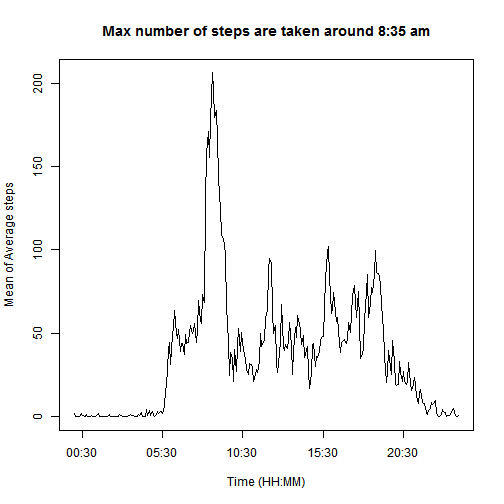

The required file is downloaded and the data is stored in the R workspace.


```r
download.file("https://d396qusza40orc.cloudfront.net/repdata%2Fdata%2Factivity.zip",
              "activity.zip")
unzip("activity.zip")

activity <- read.csv("activity.csv")
```

## Total number of steps per day 

###  Mean & Median 
The Total number of steps per day is calculated by using the following code chunk. The mean and median of the same are also calculated and printed out.


```r
stepsPerDay <- tapply(activity$steps,activity$date, sum, na.rm = TRUE)
mean(stepsPerDay)
```

```
## [1] 9354.23
```

```r
median(stepsPerDay)
```

```
## [1] 10395
```

### Histogram
Histogram of the total number of steps per day is plotted.

```r
hist(stepsPerDay, xlab = "Steps taken per day", 
     main = "Subject takes around 9000 steps on average per day")
```


## Time series of steps taken averaged over all days
### Time series plot

The aggregate function is used to find the average number of steps taken across all days for different times intervals. The strptime function is used to calculate the time from the given character format. Base plot system has been used to create the plot.


```r
library(pracma)
stepsPerTP <- aggregate(activity$steps, list(activity$interval), mean, na.rm =TRUE)
names(stepsPerTP) <- c("timeInterval", "meanAvgSteps")
stepsPerTP$timeunit <- strptime(
    paste( substring(as.character((stepsPerTP$timeInterval %/% 100)+100),2,3), 
           substring(as.character((stepsPerTP$timeInterval %% 100) +100),2,3), 
           sep = ":"), "%H:%M")

plot( stepsPerTP$timeunit, stepsPerTP$meanAvgSteps, type = "l", 
      xlab = "Time (HH:MM)", ylab = "Mean of Average steps",
      main = "Max number of steps are taken around 8:35 am")
```




### Maximum number of steps.
The time interval where in maximum number of steps were taken is given by,

```r
stepsPerTP$timeInterval[stepsPerTP$meanAvgSteps == max(stepsPerTP$meanAvgSteps)]
```

```
## [1] 835
```
## Missing values
### Total number of missing values.

```r
sum(is.na(activity$steps))
```

```
## [1] 2304
```
### Imputing missing values.

Inorder to easily impute missing values the activity data frame is converted to a table with each date representing a column and each row representing a time interval. A double for loop is used to identify missing values and when one is found the average number of steps of all days at that particular time interval is calculated and stored there.


```r
# Convert to table form using cast
library(reshape)
activityTable <- cast(activity, interval ~ date, mean, value = 'steps')
activityTableNew <- activityTable

# perform impute
for (i in 2:ncol(activityTable)){
    for (j in 1:nrow(activityTable)){
        if(is.na(activityTable[j,i])){

            activityTableNew[j,i] <- mean(as.numeric(
                activityTable[j,2:ncol(activityTable)]),na.rm = TRUE) %/% 1
     
}   }   }

# Convert the new table back to original form
activityNew <- melt(activityTableNew, id.vars = "interval", measure.vars = names(activityTableNew[,-1]))
names(activityNew)[2] <- "steps"
```
The data set with missing values filled in but similar in form to the original data set is the activityNew object. The mean and median of the total steps per day is given by 


```r
stepsPerDayNew <- tapply(activityNew$steps,activity$date, sum, na.rm = TRUE)
mean(stepsPerDayNew)
```

```
## [1] 10749.77
```

```r
median(stepsPerDayNew)
```

```
## [1] 10641
```

These values are different from that of the previously calculated estimates. The percentage change in the mean and median after the imputation is shown here.

```r
abs(meanSteps - meanStepsNew)/meanSteps*100
```

```
## [1] 14.91882
```

```r
abs(medianSteps - medianStepsNew)/medianSteps*100
```

```
## [1] 2.366522
```
The mean has been impacted to a higher extend by the imputation when compared to  the median.The estimates have non-trivial increase in their value owing to the imputation.
### Histogram: Imputed Data
The histogram of the imputed data is shown below.

```r
hist(stepsPerDay, xlab = "Steps taken per day", 
     main = "Subject takes around 10500 steps on average per day")
```


## Pattern Differences in Weekdays and Weekends.
### Factor variable creation.
A new factor variable with labels weekday and weekend has been created using the code below.

```r
day <- as.integer(weekdays(strptime(as.character(activity$date), 
                              "%Y-%m-%d")) %in% c("Saturday", "Sunday"))
activity$day <- factor(day, levels = c(0,1), labels = c("weekday", "weekend"))
```
### Time Series plot.
A panel plot comparing the steps taken, averaged over weekdays and weekends have been generated using the below code. 

```r
stepsPerTP_WK <- aggregate(activity$steps, list(activity$interval,
                           activity$day),mean, na.rm =TRUE)
names(stepsPerTP_WK) <- c("timeInterval","weekDayOrEnd", "meanAvgSteps")
stepsPerTP_WK$timeunit <- strptime(
    paste( substring(as.character((stepsPerTP_WK$timeInterval %/% 100)+100),2,3), 
           substring(as.character((stepsPerTP_WK$timeInterval %% 100) +100),2,3), 
           sep = ":"), "%H:%M")

library(ggplot2)
qplot( timeunit, meanAvgSteps, data = stepsPerTP_WK, geom = "path",
      xlab = "Time (HH:MM)", ylab = "Mean of Average steps",
      facets = weekDayOrEnd ~ .)
```


The pattern differences can be clearly seen. During weekdays there is peak activity in the mornings. However, on weekends there is no peak activity in the morning, but the overall activity throughout the day is high. Similarly the weekday activities begins at a relatively earlier time and fizziles out early compared to the weekend activity.
